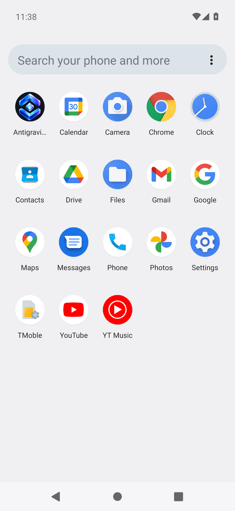
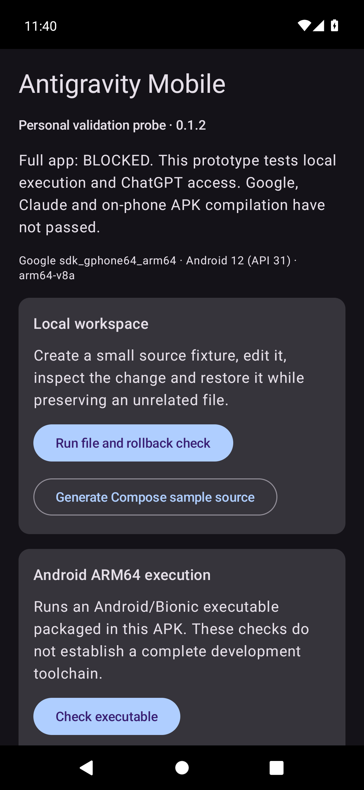

# Antigravity Mobile

For agents continuing this project, read [AGENTS.md](AGENTS.md) and the [saved checkpoint](docs/PROJECT_CHECKPOINT.md) first.


[Download the latest signed APK](https://github.com/Srimi1/antigravity--mobile/releases/latest) · [Release details](release/README.md)

A native Kotlin/Compose coding app for one Android phone: open or clone a repository, ask an agent for changes, review every edit, and commit locally.

**Status:** Latest release **0.5.1**: the Agent can now build your Android project on the phone and open the installer, with your approval ([phone test](docs/PHONE_TEST_0.5.1.md)). 0.5.0 added GitHub (token sign-in, your repositories, branches, push, pull requests, publish); 0.4.2 added Gemini through a Google AI Studio key. The app runs on the owner's OnePlus 7 Pro. Not complete: Claude is blocked, Google AI subscriptions cannot be used by third-party apps, websites are static only, and there is no general shell. All versions are on the [releases page](https://github.com/Srimi1/antigravity--mobile/releases). See the [checkpoint](docs/PROJECT_CHECKPOINT.md) and [third-party notices](THIRD_PARTY_NOTICES.md).

Version 0.1.2 includes the original adaptive launcher icon, round launcher support and an Android 13+ themed-icon silhouette. The repository artwork and icon sources are in [assets/branding](assets/branding/README.md).

 

## What the current source does

- **GitHub:** sign in with a personal access token, open any of your repositories, create branches, push, open pull requests, publish phone projects as new repositories.
- **Projects:** create, clone over HTTPS, import a folder (as a copy), start from a Compose template, export as ZIP. Browse and edit files. Git status, commit, history, pull and push (JGit, no `git` binary needed).
- **Agent:** persistent conversations with streaming replies. The agent can list, read and search files and propose writes or deletes. Each edit needs your approval, shows a diff, and is recorded. Stop works at any point; interrupted tasks are never replayed.
- **Changes:** every agent task becomes a change set with diffs. Keep it, revert it (refused if you edited the file afterwards), and commit only accepted files.
- **Websites:** start from the Hello Web template, edit and save, choose a folder and HTML entry (for example `dist/index.html`), approve a one-use copy, preview it with reload and console in the separate tools app (HTTP, file and content requests blocked), and export the folder as a ZIP. Static sites only.
- **Build:** installs a bundled companion toolchain, prepares a source snapshot for approval, runs Gradle locally in a separate foreground worker, tracks cancellation/recovery and transfers built APKs to Android’s installer. Device diagnostics remain available.
- **Accounts:** ChatGPT sign-in, test request, renewal, model choice and disconnect. Gemini with your own Google AI Studio API key. Choose which one the Agent uses. Git commit author and an encrypted HTTPS token for private repos and push.

## What is still blocked

- **Claude and Google subscriptions.** Supported, approved integration routes have not been established for this app, so both show as blocked. There is no API-key fallback.
- **ChatGPT** uses OpenAI's documented Sign in with ChatGPT flow, but has not been tested against a live account.
- **Physical phone and wider projects.** The experimental ARM64 toolchain is now integrated through a separate Android UID. The [separate Kotlin/Compose proof](docs/native-compose-qa-2026-09-30.md) succeeded; see the checkpoint for integration QA. Physical OnePlus, Node/backend websites, other languages and general desktop capabilities are not accepted. Native compatibility and redistribution requirements remain open.
- **No general shell.** The agent can run approved Gradle builds/unit-test tasks and open the APK installer, but not arbitrary commands.

## Build

Requires Java 17, Android SDK platform 36, build tools 36.0.0, NDK 27.2.12479018 and prepared runtime inputs. Gradle 8.13 is pinned by the wrapper. Kotlin 2.1.21 and AGP 8.10.1 are pinned. The APK is built on a development machine; this is distinct from proving on-phone project builds.

```bash
export JAVA_HOME=/path/to/jdk17
export ANDROID_HOME=/path/to/android-sdk
"$ANDROID_HOME/cmdline-tools/latest/bin/sdkmanager" \
  "platforms;android-36" "build-tools;36.0.0" "ndk;27.2.12479018"
# Prepare the bundled runtime (downloads are hash pinned):
python3 tools/android-runtime-lab/prepare.py --sdk "$ANDROID_HOME" \
  --gradle /path/to/extracted/gradle-8.13 --host-jdk "$JAVA_HOME"
./tools/build.sh
```

The output is `dist/antigravity-mobile-<versionName>.apk`. The script generates a local signing key once in `.signing/personal.p12`. Keep that file privately to install future updates; deleting it generates a different signer and requires uninstalling the previous app. The fixed keystore password protects this disposable development container only; filesystem permissions protect the private key. Use a separately managed key before promoting beyond the probe.

Temporary app build output lives in `~/.cache/antigravity-mobile-build`; the script keeps Gradle's project cache in `~/.cache/antigravity-mobile-gradle`. This avoids iCloud creating conflicting copies of generated compiler files. Source and delivered artifacts stay in this project.

Builds also work from `sdk.dir` in an ignored `local.properties` file. Set `ANDROID_HOME` when using the build script. No SDK paths or private signing keys are included in the source delivery.

## Device diagnostics (Build tab)

1. Install the APK using Android's installer. Android 10 or later and ARM64 are required.
2. On the Build tab, run the file/rollback check, approve the executable and nonzero-exit checks, then run cancellation.
3. On Accounts, if eligible for OpenAI's documented locally hosted app flow, use **Continue with ChatGPT**, explicitly grant plan usage, return to the app, then run **Test request**, renewal and disconnect. Do not enter an API key. These actions consume your account's authorized allowance when successful.
4. Export the JSON compatibility report from the Build tab. It contains device metrics and check results, not credentials, account email, prompts or generated code.

Network loss and access denial leave a failed check. Reconnect explicitly. If logout cannot confirm remote revocation, the history says so; disconnect the app in ChatGPT Settings. The app can request eligible Responses API access, but Android eligibility and account entitlement are not proven by source code or a compiled APK.

## Development checks

```bash
./gradlew :app:testDebugUnitTest :app:lintRelease
# Worker/main debug APKs must share the test signer:
./gradlew :build-worker:installDebug :app:connectedDebugAndroidTest
./gradlew -p samples/HelloPhone :app:assembleDebug
# Fallback when Google Maven is unreachable (compile + JVM tests only):
gradle -p tools/jvm-harness compileDeviceTestKotlin test
```

Device tests use a separate test credential file and never overwrite a saved ChatGPT account. They verify native execution/cancellation, recovery records, credential encryption, the Room v1/v2 to v3 migrations and approved worker isolation/cancellation, JGit on the device and the change ledger. JVM tests cover workspace and archive boundaries, change review and revert conflicts, JGit operations, the Responses stream format, the agent tool loop and signed-token validation. The agent loop tests use a scripted model that exists only in tests. No unit test is represented as a live subscription test.

The command probe launches only its fixed native test program, which creates no child processes. That is not proof of safe cancellation of arbitrary shell process trees. File path checks are not a shell sandbox.
