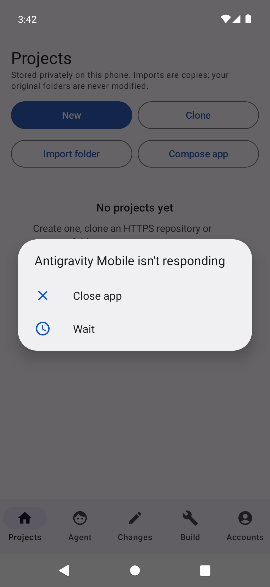

# Android emulator QA — 30 September 2026

**Result:** 0.2.0 builds with the real Android toolchain and all 46 automated tests pass. The first release launch after upgrading 0.1.2 produced an Android “isn't responding” dialog. The ANR remains unresolved; three subsequent process-cold starts did not repeat it. This is emulator validation, not physical-phone or full-product acceptance.

## Build and targets

- Source tested: `0f43adfb9e4dfb7452a1112e506ce2a5ff74b4bb`; no application source changes were needed.
- Release: `dev.srimi.antigravitymobile.probe`, version code 4, version name 0.2.0. Java 17.0.20, Gradle 8.13, AGP 8.10.1, Kotlin 2.1.21, SDK 36 and NDK 27.2.12479018.
- `./tools/build.sh`: **34 JVM tests, Room kapt, release lint and signed APK passed**. A stale Gradle instrumentation-cache reference initially failed; restarting its daemon recovered the build. The attempted cache preservation found the referenced directory already absent and moved nothing.
- `:app:connectedDebugAndroidTest`: **12 tests passed**, zero failures/errors/skips, on separate `AntigravityMobileQA_API31`, Android 12 ARM64. Includes Room v1→v2 migration, JGit init/commit/status/log on ART, ledger/revert conflicts, template extraction, native execution/cancellation and encrypted test storage.
- Manual release QA: `AntigravityMobileProbe_API31`, `emulator-5554`, Android 12/API 31, ARM64, 1080×2340 at 440 dpi. `/proc/meminfo` reports 2,013,212 KB total memory; this does not simulate the phone's 12 GB RAM. Animations remained at 1.0.
- Latest user-reported target: **OnePlus 7 Pro, 12 GB RAM, 256 GB storage** (earlier records said 7T Pro). Physical model, Android version and free storage still need verification.

Local, unpublished APK: `dist/antigravity-mobile-0.2.0.apk`.

SHA-256: `d0c488f7b597f27b649b678bead6d457ef7a1775355cd37c3009ed9d54688a9a`.

Certificate: `791980edfce3d623dfe1ba2e3209a506b01c4be7da74065805d400a5051210b5`, unchanged from 0.1.2. The published release and archives were not changed or uploaded.

## Observed issue: first-upgrade launch ANR

1. Boot the existing ARM64 AVD with the personally signed 0.1.2-probe.
2. Run its file/rollback check to leave an identifiable passing history row.
3. Build 0.2.0; run `adb -s emulator-5554 install -r <signed-release-apk>` without uninstalling or clearing data.
4. Clear logcat; start `dev.srimi.antigravitymobile.MainActivity` using `am start -W`.
5. Capture UI using `uiautomator dump /dev/tty` and `screencap`. The first capture showed Projects; a later capture showed the ANR dialog, which prevented a New-project tap.

Expected: Projects receives focus and accepts input. Observed: **10,410 ms waiting for `FocusEvent(hasFocus=true)`** at 15:41:54 IST. The input log subsequently reported 11,486 ms processing that event. `am start -W` had returned a 2,885 ms launch time: its “ok” result did not establish responsiveness.

The first launch overlapped the second emulator and debug instrumentation build. App logcat reports skipped-frame batches of 56, 60 and 104. The ANR CPU snapshot reports graphics composer at 45%, `kswapd0` at 15% and the app at 4.9%. This makes environment contention worth checking; it does **not** establish the cause. The main-thread stack collected several seconds later was already polling the Looper and cannot identify the work that delayed focus.

Selecting **Wait** recovered the app. After stopping the test emulator and Gradle daemon, three process-cold starts produced no new ANR; the last-ANR timestamp remained the original one. One occurrence followed by three non-reproductions is not a verified fix.

## Functional checks

| Flow | Result/evidence |
| --- | --- |
| Upgrade/history | Exact passing fixture `checks/a5d2d6f8-e831-4fc3-bb4e-a545635297f2` retained; `migration-history.png/xml`. |
| Project/Git | `QAScratch` created through UI; Git reports main and one untracked README. |
| Editor/restart | Saved `QA-saved-content`; reopened after three force-stops/launches with content intact. |
| Navigation | All five tabs captured as PNG and UI XML. Agent disconnected; no live provider request. |
| Compose template | `Hello Phone` created. Inspector detects Gradle/wrapper/Android module; no APK, build disabled. |
| Durability/cancellation | Existing instrumentation tests passed. Live agent process-kill recovery remains untested. |

Minor observations: file-list size stayed stale until refresh/restart after saving, and the template ZIP contained two empty `.kotlin/` directory entries. No app fixes were made in this QA.

## Performance evidence

Same release APK, existing project data retained. Three controlled runs force-stopped the process, launched with `am start -W`, waited one second and captured UI. These are process-cold starts, not clean-install/reboot measurements.

| Measurement | Result |
| --- | --- |
| Controlled launch `TotalTime` | 796, 749, 705 ms; median 749 ms |
| First-upgrade launch | 2,885 ms, followed by ANR |
| Navigation capture | Open saved README → close editor → Git → Files; one run |
| `gfxinfo` frames | 62 |
| Frame percentiles | p50 36 ms; p90 57 ms; p95 61 ms; p99 65 ms |
| Jank counters | Modern 0/62; legacy 61/62; legacy deadline misses 58. Counters disagree. |
| Post-navigation memory | PSS 54,028 KB (52.8 MiB); RSS 165,668 KB; swap 0 |

The GPU histogram has zero samples despite displaying 4,950 ms percentile placeholders. Do not use those values or modern 0% jank as a smoothness claim. Emulator graphics, captures and host load affect timing. One memory snapshot cannot establish a leak; these numbers do not predict OnePlus performance.

Raw Perfetto captures: recovery after ANR (6,017,781 bytes) and project navigation (3,542,576 bytes). Navigation config requests scheduler, Android atrace, process stats and SurfaceFlinger frame timeline. No trace-processor analysis was performed; no frame-timeline/recomposition or function-hotspot conclusion is claimed. Recovery tracing started after the timeout and cannot explain the preceding stall.

## Artifacts and next step

Curated screenshots, full UI XML, app/system logcat, frame/memory data and machine-readable summary: [`assets/screenshots/qa-20260930`](../assets/screenshots/qa-20260930). Tracked text logs have trailing whitespace removed; raw originals are preserved in the bundle. Full build/lint output, test XML, raw ANR DropBox stacks, interaction steps and traces:

`/Users/srimi/.cache/antigravity-mobile-qa/20260930-first-full-app/`

Complete local bundle: `dist/antigravity-mobile-emulator-qa-20260930.zip`, ignored by Git, with companion SHA-256 file. No accounts were connected or account tokens exported.

Next: trace **before** launch, compare a lone-emulator cold start against controlled host contention, and inspect input dispatch/first rendering around any repeated timeout. Then verify the physical phone while preserving data and signer. ChatGPT live coding remains unverified; Claude/Google routes and phone builds remain blocked.
