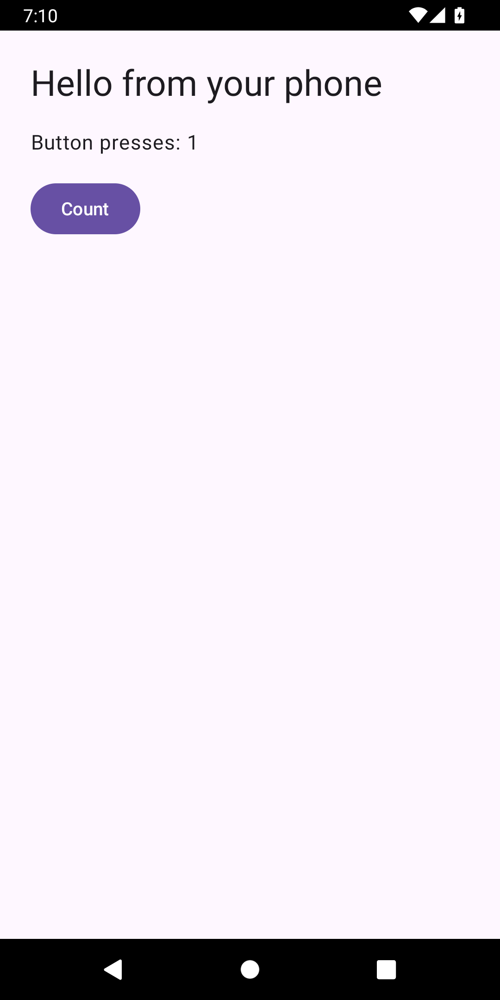

# Compose toolchain investigation — 30 September 2026

**Full Compose sample compiled, installed, launched and interacted with on Android 12 ARM64. Full product remains BLOCKED.** Main APK is unchanged and unreleased. Baseline `b5dfa65f3af74f8d5c6ca2ec97d19769ef016a26`; recovery ref `refs/checkpoints/before-compose-trace-20260930`. These are new lab scratch tasks, not replays of the uncertain initial Compose build. The original guest reboot remains unexplained: checked DropBox tags had no last-kmsg/restart/watchdog entries; pstore access was denied and no root was used.

## Changes

- Reduced Gradle CLI heap from 1,200 MB to 192 MB; single build worker. Daemon remains 1,200 MB and Kotlin compiles in-process.
- Atomic begin/end records share an attempt ID. An old success record cannot conceal a later interrupted action. An uncertain label is refused; Compose requires a new explicit task ID. Six lab instrumentation tests passed in 9.681 seconds, including the new refusal regression. This is not a production Room/foreground-service implementation.
- Added `tools/android-runtime-lab/capture.py`: refuses existing output directories and output inside the repository, captures one explicit task with an owned Perfetto process and memory snapshots, and preserves failure evidence without restarting.
- Included platform `build.prop` in SDK data; pinned the actual HelloPhone sample to Build Tools 36.0.0. No license acceptance was fabricated and no desktop SDK native executables were substituted. SDK data/native-resource version mix remains experimental as described in the previous report.
- Updated lab assembly, instrumentation APK and lint passed after these SDK metadata fixes. Main app and physical phone have not been rebuilt/tested for this change.

## Evidence from completed attempts

| Task | Actual result |
| --- | --- |
| `compose-trace-20260930-01` | FAILED, exit 1, 9,300 ms; Gradle reports corrupted caches. No guest reboot. Original cache preserved. Pipe trace was empty and invalid. |
| `compose-trace-20260930-02` | FAILED, exit 1, 122,904 ms; fresh per-task cache reached AGP, which requested absent Build Tools 35.0.0 and reported missing platform build properties. No guest reboot or APK. |

Curated logs, timings and snapshots: [assets/screenshots/compose-20260930](../assets/screenshots/compose-20260930/). Full raw cache-error log and trace stay under `~/.cache/antigravity-mobile-runtime/evidence/`. Cache corruption after the earlier reboot is observed, not proven to have been caused by it. Each subsequent Compose scratch task gets a separate cache; no old cache was deleted.

The second capture is a real 28,486,041-byte Perfetto trace, parsed by official trace_processor_shell v58.2 for macOS ARM64 (SHA-256 `d29864d1ba3b36855527bb1b0ca3aa7f703cdce338b9680bb922c5c151b358fa`). There are 130 MemAvailable samples; minimum 557,662,208 bytes. Sampled peak RSS: lab controller 116,592,640 bytes, CLI JVM 96,874,496 bytes, Gradle daemon 999,292,928 bytes. RSS contains shared mappings; these are individual sampled values, not additive PSS, true instantaneous peaks or OnePlus measurements.

The trace had one health warning, `config_write_into_file_no_flush`; subsequent capture configuration supplies a flush period. This warning concerns trace-processing memory. No other nonzero warning/error stat was reported by the health query. It does not explain the original reboot or prove the full build resource requirement.

## Successful full Compose run

Task `compose-trace-20260930-03` used the corrected SDK metadata, Build Tools 36.0.0 and a fresh cache. **PASSED**: Gradle `BUILD SUCCESSFUL in 3m 37s`, 35 tasks executed; instrumentation `OK (1 test)`, 222.88 seconds; matching atomic begin/end attempt IDs, exit 0. The full Kotlin/Compose sample was compiled and signed by processes running inside Android. No host compiler built that APK.

The generated 23,669,266-byte APK is private at `~/.cache/antigravity-mobile-runtime/compose-android-built.apk`, SHA-256 `3d1b2cd085d2b31a7c5f040b6339fd41de47d76797fcdc0501a221bcb7531a0a`. It installed without uninstalling another app, launched `dev.srimi.hellophone/.MainActivity` (cold TotalTime 1,323 ms, WaitTime 1,331 ms), and its Count button changed “Button presses: 0” to “Button presses: 1”. Tap coordinates came from the fresh UI XML. Screenshots were visually inspected. The host ADB test harness controlled installation/launch; the main Antigravity Build UI does not yet perform this workflow.

Raw run directory: `~/.cache/antigravity-mobile-runtime/evidence/compose-trace-20260930-03/`. Full trace is 54,592,675 bytes, parsed successfully, with no nonzero warning/error stats returned by the health query. Curated logs, XML, screenshots, begin/end records, memory samples and trace reports are in `assets/screenshots/compose-20260930/03/`. Binaries and the full trace remain outside Git. Current lab/test APK sizes and hashes plus runtime-data digest are in `assets/screenshots/compose-20260930/current-artifacts.json`; lab build output filenames were overwritten by the later SDK metadata build.

- 228 system-memory samples; minimum MemAvailable **27,557,888 bytes (about 26.3 MiB)**. This was a tight 3 GB emulator run; no guest reboot occurred. It does not establish a safe peak requirement for larger repositories.
- Sampled peak RSS: controller 369,467,392 bytes; client JVM 94,789,632 bytes; daemon JVM 1,610,240,000 bytes; aapt2 16,449,536 bytes. Individual RSS values include shared mappings and are not additive PSS or exact instantaneous peaks.
- Launched app snapshot: 73,932 KB PSS, 155,000 KB RSS, zero swap. Four captured frames: modern jank 0, legacy 2, percentile buckets 32/400 ms. Small sample and conflicting counters prevent a smoothness conclusion.
- AGP warned that platform-tools were absent and their licence unaccepted. They were not used for this build. No licence acceptance was forged. Native resource binaries remain 35.0.2 alongside SDK data 36; this is still an experimental mixed profile.

## Next required work

Integrate the verified compiler pipeline into the main Kotlin app with explicit command approval, credential isolation, foreground execution, durable recovery, bounded output, cancellation and on-phone installation/launch. Broader Java/Gradle repositories, Kotlin tests, other languages and website runtimes remain unvalidated. The Android port's legacy heap-tagging compromise, security maintenance and redistribution/source notices require resolution before shipping. Mandatory live subscriptions, physical OnePlus validation and the earlier first-upgrade ANR remain open. Main app remains 0.2.0/code 4; its earlier APK was not rebuilt or published here. QA emulator is left running with the successful Compose fixture; no Compose build remains in flight.
