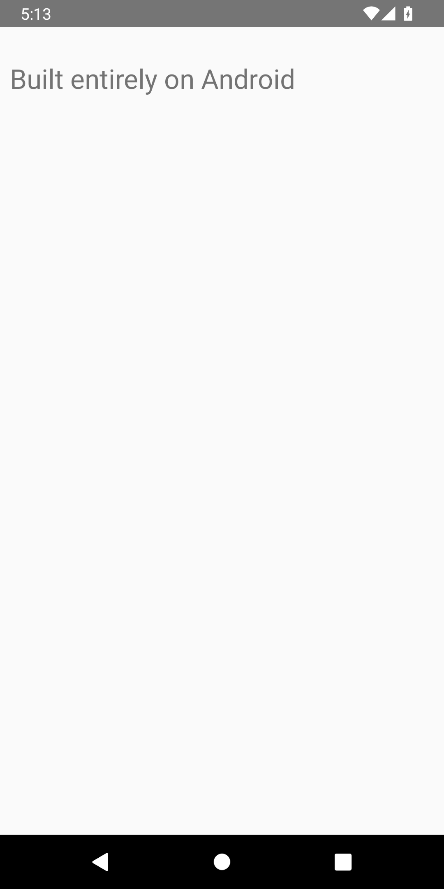

# Android-native runtime evidence — 30 September 2026

**Earlier partial toolchain validation; superseded by [successful Compose evidence](native-compose-qa-2026-09-30.md). Full product remains BLOCKED.** A separate credential-free lab APK compiled, signed and verified a small Java Android APK entirely on an Android 12 ARM64 emulator. That generated APK installed and launched. The toolchain is not integrated into the main app. Full Kotlin/Compose compilation was interrupted by an unexpected emulator guest reboot; it has no success result or generated APK. No physical OnePlus or live account was used.

## Scope and source

- Source baseline: `f9c37fc7efc3a3e212da94b681b887e66b612354`, clean and equal to fetched `origin/main` before edits. Recovery ref: `refs/checkpoints/before-native-runtime-20260930`.
- New source: [tools/android-runtime-lab](../tools/android-runtime-lab/README.md). Separate package `dev.srimi.antigravityruntime.lab`, version `0.1-lab`; the main app remains unreleased 0.2.0, code 4. Published 0.1.2, its signer, release archives and Drive artifact are unchanged.
- Device: `AntigravityMobileQA_API31`, `emulator-5556`, Android 12/API 31, `arm64-v8a`, 1080×2160, configured 3,072 MB RAM. This does not emulate the user's OnePlus hardware or validate its 12 GB RAM/256 GB storage.
- Host preparation assembles and packages the initial runtime APK. The test then writes project source and runs the compiler, D8, Android-native aapt2, JAR tool, keytool and apksigner inside Android. No desktop process compiles that fixture APK.
- Native executables are Android/Bionic ARM64 files installed by PackageManager, with app-private logical JDK/SDK aliases. No root, Termux, remote desktop build, cloud build or paid API is used.

## Outcomes

| Check | Actual result |
| --- | --- |
| Lab AGP assembly and lint | PASSED: `assembleDebug`, `assembleDebugAndroidTest`, `lintDebug`; six lint warnings, no errors |
| Java source → class → execution | PASSED; real compiler present, `ANDROID_JAVA_COMPILED_OK` |
| Parent JVM starts child JVM | PASSED; `CHILD_JVM_OK` |
| Gradle 8.13 startup on Bionic | PASSED; version output verified |
| Android Java APK compile/dex/resources/sign/verify | PASSED; apksigner verifies APK Signature Scheme v3 |
| Parent and child cancellation | PASSED; deliberate six-second timeout, both recorded PIDs ceased to exist |
| Instrumentation summary | `OK (5 tests)`, 10.554 seconds; these are separate from the main app's 34 JVM/12 device tests |
| Generated fixture APK installation and launch | PASSED; package `dev.srimi.nativebuild`, activity `.MainActivity`, displayed “Built entirely on Android” |
| Full Gradle Kotlin/Compose sample | INTERRUPTED; project configuration began, guest rebooted, no end JSON or resulting APK |
| Main app Build integration / foreground durability | NOT IMPLEMENTED by this lab |
| Physical OnePlus / live subscriptions | NOT TESTED |

The screenshot and UI XML come from the installed generated fixture, not the Antigravity UI. The complete native compilation/signing runs are genuine processes, rather than scripted provider replies. Tests create only owned scratch projects. The disposable signing fixture remains private on the emulator and was not exported.

## Logs and performance limits

Curated screenshots, UI XML, instrumentation output, host build/lint output, command logs/records and device metadata are in [assets/screenshots/runtime-20260930](../assets/screenshots/runtime-20260930/). Curated text has trailing whitespace normalized; raw files remain unmodified in `~/.cache/antigravity-mobile-runtime/evidence/`; generated runtime/build data remain outside iCloud and Git.

Process timings below are measured elapsed time for individual command invocations. They omit installation, runtime extraction and dependency download. The keytool record is from the initial fixture creation; the final regression reused that fixture.

| Command | Exit | Elapsed ms | Timed out |
| --- | --- | --- | --- |
| `javac` | 0 | 302 | false |
| `java-run` | 0 | 102 | false |
| `children-compile` | 0 | 302 | false |
| `children-run` | 0 | 202 | false |
| `gradle-version` | 0 | 603 | false |
| `android-javac` | 0 | 402 | false |
| `android-d8` | 0 | 603 | false |
| `android-aapt2-compile` | 0 | 106 | false |
| `android-aapt2-link` | 0 | 505 | false |
| `android-jar` | 0 | 102 | false |
| `android-keytool` | 0 | 404 | false |
| `android-sign` | 0 | 402 | false |
| `android-verify` | 0 | 204 | false |
| `cancel-compile` | 0 | 502 | false |
| `cancel-run` | 143 | 6108 | true |

- Fixture cold launch: `am start -W` returned Status `ok`, TotalTime 377 ms, WaitTime 378 ms. One launch only.
- Fixture memory snapshot: 17,283 KB PSS, 114,296 KB RSS, zero swap. This measures the small launched app, not the compiler or the full Antigravity app.
- Graphics capture contains only one frame: modern jank count 0, legacy count 1, percentile bucket 200 ms. Counters conflict; no smoothness claim can be made from it.
- A lab controller snapshot during Compose configuration was 14,098 KB PSS/71,860 KB RSS. Native JVM child processes are excluded, so this is not total or peak build memory.
- During the first Compose attempt, ADB became offline while the QEMU host process remained running. Guest uptime reset; boot reason was `reboot`. Partial output stops after configuring `:app`. No system-server watchdog evidence was found in the checked DropBox record. The cause is unknown; there is no analyzed pre-reboot trace. The interrupted task was not automatically replayed.
- A host Gradle daemon initially exhausted its default 512 MB heap while packaging the runtime. The lab now requests 2 GB and stores the ZIP asset without recompression. Final assembly/lint succeeded. Its heap dump was preserved privately outside the workspace and was neither inspected nor exported.

## Runtime inputs and compatibility work

| Input | Pinned SHA-256 |
| --- | --- |
| [MojoLauncher Android OpenJDK 17 runtime](https://github.com/MojoLauncher/android-openjdk-build-multiarch) | `c0f1cf02a567b07ea1e3bba2114eec1657b6e51513c9af7958cae27e4f614440` |
| [Temurin 17.0.18+8 Linux ARM64 classes](https://github.com/adoptium/temurin17-binaries/releases/tag/jdk-17.0.18%2B8) | `592a6702b3a07a0e0b82cb38aaab149bfce1b0c24d6b57ddb410bd9009333095` |
| [Android-native SDK tools 35.0.2](https://github.com/lzhiyong/android-sdk-tools) | `db1cea2c4454d5f9c5a802646b2d1cf560b4ee7badbe23e51ab8e1881bb50fc2` |

Only Java compiler/tool classes and legal notices are taken from the desktop JDK; its executables and native libraries are excluded. Java implementation classes from the Android port are preserved. `jimage`/`jlink` on the development machine assemble a consistent module image, remove vendor-specific cross-module hashes and regenerate per-image system metadata. The combined image is a new distribution, not an unchanged vendor image. Its complete data archive has SHA-256 `6ebf4f6e924c7e5bab5b89048c9035148e8288df77a668e5c2d515ad34ff6f90`. Host assembler: 17.0.20; actual Android runtime: 17.0.18. Original source builder commit: `366dbc0d12cffc66940766d5ad7d5fc517784f2f`.

Native resource tools are 35.0.2; SDK Java/platform data are 36. This mixed profile passed the small fixture and has not passed the full AGP/Compose pipeline. Gradle native integration, file watching and instrumentation agent are disabled; Kotlin compilation is configured in-process.

Compatibility fixes validated during development:

1. A loader shim reports the existing logical `libjvm` alias through `dladdr` and `dl_iterate_phdr`, allowing HotSpot to locate its module image before Java options are parsed. Actual mappings and segment metadata are preserved.
2. Rebuilding module metadata resolved vendor/module-target/hash conflicts; disabling duplicate JLI species generation resolved the boot-image class conflict.
3. The port truncated tagged native pointers and aborted. The lab uses Android's legacy heap-tagging setting plus public NDK `mallopt` compatibility in worker processes. This reduces that protection and does not establish native memory correctness or MTE compatibility. See [Android tagged pointers](https://source.android.com/docs/security/test/tagged-pointers). Native remediation/current-runtime maintenance and broader Android testing are required before shipping.
4. A launcher-owned process group enables the tested JVM/child cancellation. This is not a general command sandbox or a foreground execution service.

## Earlier local artifacts (not published)

These hashes describe the first capture. Lab build output filenames are reused by later builds; see the Compose report for current artifact hashes. The Java proof APK remains preserved.

- Lab debug APK: `~/.cache/antigravity-mobile-runtime/build/app/outputs/apk/debug/app-debug.apk`, 259,860,065 bytes, SHA-256 `7f14a2014e5087269c408f13802f096272ee573d2eca4974c45f6bdb8c6cb610`.
- Lab test APK: same build tree under `outputs/apk/androidTest/debug/`, SHA-256 `134f342635469b3578de10d1ae025b8b92a02480c2d8952b095e00ffce7fc5b1`.
- Installed/launched proof APK: `~/.cache/antigravity-mobile-runtime/phone-built-proof.apk`, 8,597 bytes, SHA-256 `731d24343bc309331976217313eebf5aeb888f932f3ced021dcce03bea15d2ee`. Subsequent scratch regression output is separate; the screenshot refers to this installed proof.
- Data archive is 242,629,926 bytes before APK packaging. Installed runtime, dependency cache and peak build storage/RAM have not been measured as a full product workload.

## Next actionable work

Diagnose the guest reboot with tracing before starting an explicitly new Compose scratch build. Do not resume or replay the uncertain prior action. Require a real Compose APK build, install and launch before claiming that pipeline works. Then integrate approved, durable build execution into the main Kotlin app, with foreground lifecycle, process cancellation, bounded file operations and recoverable interruption. Preserve credentials outside the command worker. Review upstream notices/corresponding-source requirements before redistributing a runtime APK. Validate on the physical OnePlus and establish all mandatory live subscription routes. The original app's first-upgrade ANR remains unresolved.
